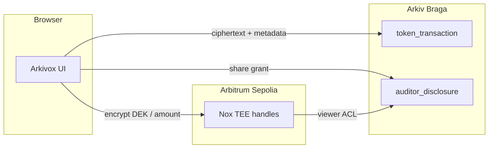

# Arkivox

[](https://github.com/armsves/arkivox/actions/workflows/ci.yml)
[](LICENSE)
[](https://docs.arkiv.network/)
[](https://github.com/iExec-Nox/demo-ctoken)

**Live demo:** [arkivox.vercel.app](https://arkivox.vercel.app)

Arkivox (*Arkiv* + *Nox*) is a testnet demo for a **confidential token ledger** with **selective disclosure**. Record transfers on [Arkiv Braga](https://docs.arkiv.network/), protect amounts with [iExec Nox](https://github.com/iExec-Nox/demo-ctoken) on Arbitrum Sepolia, and share exactly one transaction with an auditor — not your full history.

## Features

- **Confidential transfers** — AES-encrypted payloads on Arkiv; DEK wrapped in a Nox handle
- **Public wrap / unwrap** — on-chain cToken ops logged in plaintext (already public on Arbiscan)
- **Selective disclosure** — grant an auditor wallet access to one transaction’s amount
- **Revoke** — Arkiv tombstone + app-side block (on-chain `removeViewer` when Nox supports it)
- **Wallet-first** — MetaMask / WalletConnect via Reown AppKit; Braga + Arbitrum Sepolia in one flow

## How it works



| Transaction type | On-chain (cToken) | On Arkiv |
|------------------|-------------------|----------|
| **Transfer** | Confidential (ERC-7984) | Encrypted (v3) + Nox DEK |
| **Wrap / unwrap** | Public | Plaintext reference + Arbiscan tx hash |

## Who sees what

| Role | Arkiv index (public) | After reveal |
|------|----------------------|--------------|
| **Owner** | Entity type, timestamps | Full amount, memo, counterparty |
| **Auditor** | Grant / parent hashes only | One shared transaction |
| **Everyone else** | Same minimal metadata | Nothing |

## Stack

| Layer | Network | Role |
|-------|---------|------|
| **Arkiv** | Braga (testnet) | Durable `token_transaction`, `auditor_disclosure`, `auditor_revocation` |
| **Nox** | Arbitrum Sepolia | TEE key handles, `addViewer` for auditors |
| **UI** | Next.js 16 | Terminal-style wallet app |

`PROJECT_ATTRIBUTE`: `project = arkivox-7k2m` (legacy scope `arkiv-vault-nox-demo-7k2m` still indexed)

## Quick start

### Run locally

```bash
git clone https://github.com/armsves/arkivox.git
cd arkivox
npm install
cp .env.local.example .env.local
# optional: NEXT_PUBLIC_WALLETCONNECT_PROJECT_ID from https://cloud.reown.com
npm run dev
```

Open [http://localhost:3000](http://localhost:3000).

### Fund testnet wallets

1. **ETH** — [Sepolia faucet](https://cloud.google.com/application/web3/faucet/ethereum/sepolia) → [bridge to Arbitrum Sepolia](https://portal.arbitrum.io/bridge?sourceChain=sepolia&destinationChain=arbitrum-sepolia)
2. **USDC / RLC** (wrap demos) — [Circle faucet](https://faucet.circle.com/) (Arbitrum Sepolia)
3. **Braga GLM** — [Arkiv faucet](https://braga.hoodi.arkiv.network/faucet/)

Use the in-app **Faucets** link for the full list.

## Environment

| Variable | Required | Description |
|----------|----------|-------------|
| `NEXT_PUBLIC_WALLETCONNECT_PROJECT_ID` | Recommended | Reown / WalletConnect project ID |
| `NEXT_PUBLIC_ARKIV_PROJECT` | No | Override Arkiv `project` attribute (default `arkivox-7k2m`) |
| `NEXT_PUBLIC_APP_URL` | No | Canonical URL for OG metadata (set on Vercel) |

## Scripts

```bash
npm run dev          # local dev server
npm run build        # production build
npm run lint         # ESLint
npm run test:e2e:smoke   # 1-key Arkiv + Nox smoke test
npm run test:e2e         # 2-key share + revoke flow
```

E2E tests need funded keys — see `.env.test.example`.

## Deploy

[](https://vercel.com/new/clone?repository-url=https%3A%2F%2Fgithub.com%2Farmsves%2Farkivox&env=NEXT_PUBLIC_WALLETCONNECT_PROJECT_ID&envDescription=Reown%20project%20ID%20(recommended)&project-name=arkivox)

Set `NEXT_PUBLIC_WALLETCONNECT_PROJECT_ID` in the Vercel project settings for reliable wallet pairing.

## References

- [Arkiv documentation](https://docs.arkiv.network/)
- [iExec Nox demo-ctoken](https://github.com/iExec-Nox/demo-ctoken)
- [Arkiv agent skills](https://github.com/Arkiv-Network/skills)

## License

[MIT](LICENSE)
