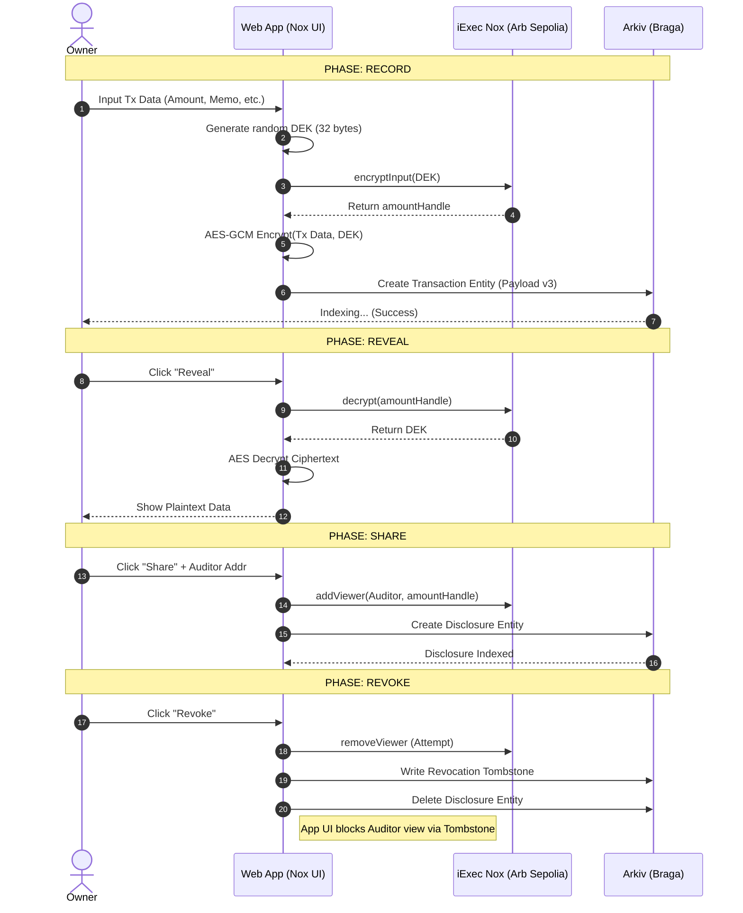
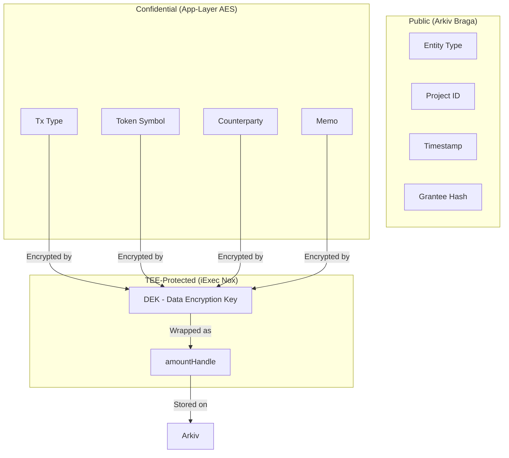

# cToken Ledger on Arkiv: Design & Architecture Package

## 1. User Personas

| Persona | Role | Primary Goal | Pain Point |
| :--- | :--- | :--- | :--- |
| **Alice (The Owner)** | DeFi User | Record private transactions and selectively prove them to others. | Managing keys across multiple chains and explaining privacy to auditors. |
| **Bob (The Auditor)** | Compliance Officer | Verify Alice's transaction amounts without seeing her entire history. | Trusting that a "private" ledger hasn't been tampered with. |
| **Charlie (The Judge)** | Hackathon Judge | Evaluate the technical implementation and UX of the privacy stack. | Understanding the difference between AES (app-layer) and Nox (TEE-layer) security. |

---

## 2. User Journeys (Swimlanes)

### Journey: Record → Reveal → Share → Revoke



---

## 3. Data & Trust Diagram



---

## 4. Information Architecture & Wireframes

### Screen Inventory
1.  **Dashboard (My Ledger):** Main hub for viewing and managing transactions.
2.  **Record Transaction:** Form for new entries.
3.  **Auditor View:** Specialized landing page for third-party disclosure.
4.  **Chain Switcher:** Global component for Reown/wagmi.

### Low-Fi Wireframe: Dashboard
```text
[ Global Header: "cToken Ledger" | Wallet | Chain Badge ]
---------------------------------------------------------
(Tabs: [My Ledger] [Record] [Disclosures])

[ List of Transactions ]
+-------------------------------------------------------+
| Type: Transfer | Token: cUSDC | State: [Encrypted]    |
| [ Reveal Button ] [ Share Button ]                    |
+-------------------------------------------------------+
| Type: Wrap     | Token: cRLC  | State: [Decrypted]    |
| Amount: 500.00 | Memo: "Seed" | [ Revoke Access ]     |
+-------------------------------------------------------+
```

---

## 5. Security & Privacy UX Copy

*   **Tooltip (Encrypted State):** "This data is encrypted using AES-256-GCM. The key is wrapped in a Nox handle on Arbitrum Sepolia. Only the owner or authorized viewers can reveal it."
*   **Warning (Revocation):** "Revocation writes a tombstone to Arkiv immediately. However, if Nox `removeViewer` is pending on-chain, the handle remains decryptable in the TEE until the next contract sync."
*   **Confidentiality Note:** "We never store your plaintext amount or memo. Even Arkiv indexers only see that 'something' was recorded for this project."

---

## 6. Design System (Dark/Infra)

*   **Colors:**
    *   Background: `#0A0A0B` (Deep Matte Black)
    *   Surface: `#161618` (Dark Grey)
    *   Primary (Nox): `#FFD700` (Cyber Gold)
    *   Secondary (Arkiv): `#00FF94` (Neon Green)
    *   Status/Encrypted: `#6B7280` (Muted Slate)
*   **Typography:**
    *   Headings: `JetBrains Mono` (Bold)
    *   Body: `Inter` (Medium/Regular)
*   **Component Pattern (The "Privacy Badge"):**
    *   Status: `Locked` (Grey/Outline) → `Unlocked` (Gold/Glow).

---

## 7. Demo Script (3-Minute Hackathon Pitch)

*   **0:00 - 0:30 (Problem):** "Transparency is a bug for private enterprise. If I pay a vendor, I don't want the world knowing the amount or the memo."
*   **0:30 - 1:30 (Solution):** "cToken Ledger combines the tamper-evidence of Arkiv on Braga with the hardware-level confidentiality of iExec Nox. Watch as we record a transaction: the amount is hidden behind a Nox handle."
*   **1:30 - 2:30 (The Reveal & Share):** "I can reveal it in-session, or share a specific 'Disclosure Entity' with my auditor. The auditor sees ONLY that transaction, validated by the TEE."
*   **2:30 - 3:00 (The Revoke):** "Privacy is about control. I can revoke access at any time, leaving a tombstone on Arkiv that invalidates the disclosure permanently."

---

## 8. Comparison Table (v2 vs v3)

| Feature | Payload v2 (Legacy) | Payload v3 (Current) |
| :--- | :--- | :--- |
| **Public Attributes** | Amount, Token, Memo | `entityType`, `project` only |
| **Key Management** | User-stored key | Nox-wrapped DEK |
| **Compliance** | Full history disclosure | Selective, single-tx handles |
| **Trust Model** | Trust the indexer | Trust the TEE (Nox) |
